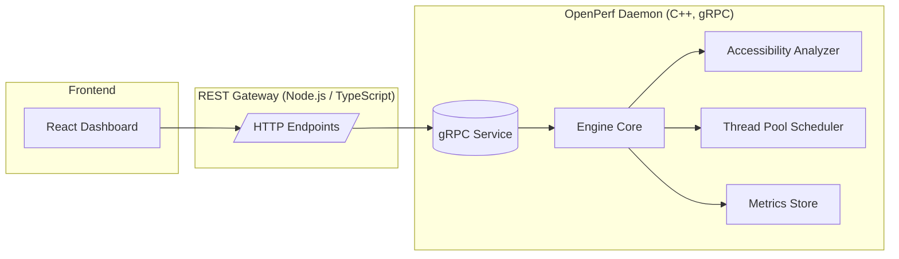
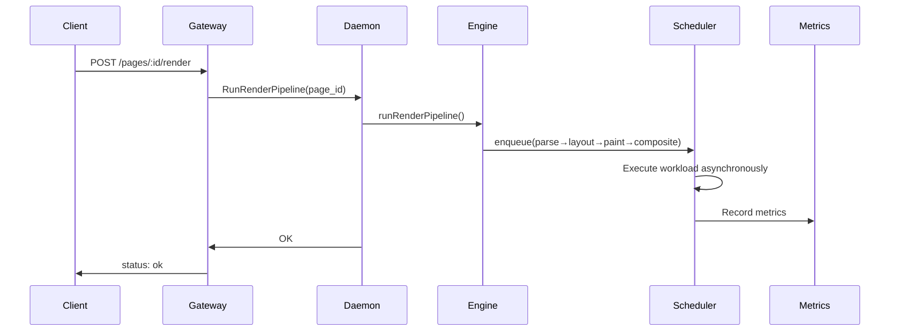
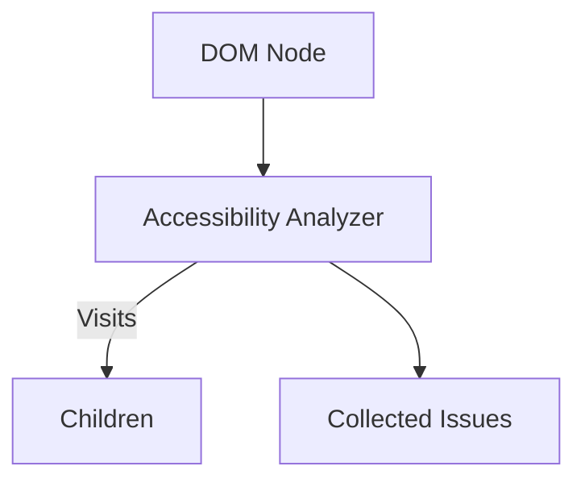

# OpenPerf

## High-Performance, Cross-Platform Browser Engine Component

_C++ · gRPC · Node.js · TypeScript · React_

OpenPerf is a modular, high-performance subsystem that simulates the internals of a browser engine—complete with a staged render pipeline, accessibility analysis, live metrics, a thread-pool scheduler, and a React dashboard for real-time visualization.

It mirrors concepts used in production browser engines like Chrome and Firefox, while remaining lightweight, understandable, and easy to extend.

---

# Architecture Overview

## System Architecture



---

# Features

## Multi-Threaded Render Pipeline

- Simulates real browser stages: **Parse → Layout → Paint → Composite**
- Executes asynchronously through a thread-pool scheduler
- Records per-stage and total latency metrics

## Accessibility Engine

- Analyzes a DOM-like tree structure
- Implements WCAG-inspired heuristics, including:
  - Missing `` alt text
  - Missing labels on interactive elements
- Easily extensible with new checks

## Modular IPC Layer (gRPC)

- Engine runs as a standalone C++ daemon
- Exposed via protobuf-defined RPCs
- Strict typing between components

## REST Gateway (Node.js / TypeScript)

- Converts REST → gRPC
- Lets React dashboard interact with the engine
- Handles CORS and structured JSON responses

## React Dashboard

- Live performance metric charts
- Accessibility issue viewer
- Page submission UI
- Built with Vite + TypeScript + React

## Metrics Subsystem

- Thread-safe recording of named metrics
- Timestamped samples
- Exposed over `/metrics` REST endpoint

---

# C++ Engine Internals

## Staged Render Pipeline

OpenPerf simulates the major phases of a modern browser engine:



### Metrics Recorded

| Metric                       | Description                     |
| ---------------------------- | ------------------------------- |
| `parse_ms`                   | DOM parsing time                |
| `layout_ms`                  | Box model + layout calculations |
| `paint_ms`                   | Visual paint stage              |
| `composite_ms`               | Layer compositing               |
| `render_pipeline_latency_ms` | End-to-end latency              |
| `task_queue_depth`           | Scheduler queue depth           |

---

## Thread Pool Scheduler

A high-performance scheduler inspired by browser task dispatchers.

```mermaid
flowchart TD
    Enqueue[enqueue(task)] --> Q{Task Queue}
    Q --> Worker1
    Q --> Worker2
    Q --> Worker3
    Worker1 --> Done1
    Worker2 --> Done2
    Worker3 --> Done3
```

- Lock-free queue (optional future enhancement)
- Work stealing model (planned)
- Backpressure metrics included

---

## Accessibility Subsystem

The engine walks the DOM-like tree and applies heuristic rules.

Example checks:

- Missing `` → `IMG_ALT_MISSING`
- Interactive element without label → `ACCESSIBLE_NAME_MISSING`



Output format:

```json
{
  "issues": [
    {
      "code": "IMG_ALT_MISSING",
      "message": "Image element is missing descriptive text or aria-label.",
      "severity": "SEVERITY_WARNING",
      "node_id": "hero-image"
    }
  ]
}
```

---

## REST Gateway (Node.js / TypeScript)

The REST gateway wraps the gRPC calls:

| REST Endpoint            | Purpose                  |
| ------------------------ | ------------------------ |
| `POST /pages`            | Submit a page tree       |
| `POST /pages/:id/render` | Run pipeline             |
| `GET /pages/:id/a11y`    | Get accessibility issues |
| `GET /metrics`           | Get recorded metrics     |

The gateway transforms JSON → protobuf → gRPC.

---

## React Dashboard

The dashboard provides:

- Real-time charts (Recharts or Chart.js)
- Accessibility issue tables
- Page submission UI

Components:

```
src/
  components/
    MetricsChart.tsx
    A11yTable.tsx
  App.tsx
```

Example: Metrics chart:

```tsx
<MetricsChart metric="render_pipeline_latency_ms" />
```

---

## Example Usage (curl)

### Submit a page

```bash
curl -X POST http://localhost:3000/pages \
  -H "Content-Type: application/json" \
  -d '{
    "url": "https://example.com",
    "root": {
      "tag": "div",
      "id": "root",
      "children": [
        { "tag": "img", "id": "hero-image" }
      ]
    }
  }'
```

### Run the render pipeline

```bash
curl -X POST http://localhost:3000/pages/page-0/render
```

### Accessibility report

```bash
curl http://localhost:3000/pages/page-0/a11y
```

### Metrics

```bash
curl http://localhost:3000/metrics
```

---

# Build Instructions

## Requirements

- CMake ≥ 3.16
- C++20 compiler
- gRPC + Protobuf
- Node.js ≥ 18
- pnpm or npm

## Build C++ Daemon

```bash
cd openperf
mkdir build && cd build
cmake ..
cmake --build .
./daemon/openperf_daemon 0.0.0.0:50051
```

## Run Gateway

```bash
cd gateway
npm install
npm run dev
```

## Run Dashboard

```bash
cd dashboard
npm install
npm run dev
```

---

# Roadmap

## Short-Term Enhancements

- Replace mutex map with lock-free concurrent map
- Add C++20 modules
- Implement work stealing in scheduler
- Add flamegraph-like breakdown in dashboard

## Medium-Term

- WASM-based node inspector in the dashboard
- Real layout calculations (flexbox / absolute)
- Simulated GPU compositing stage

---

# Credits

Designed and built by Sari Hammad.
Inspired by Chrome's architecture and modern browser engine internals.
